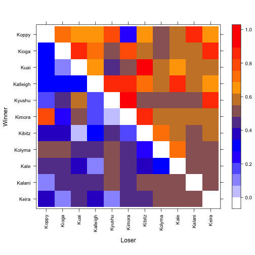

Rank order and the certainty of the win-loss relationships are two aspects of ranking relationships. Win-loss information can be found not only from direct interactions, but also information from indirect pathways between all pairs of nodes. The Perc package quantifies both rank order and dominance certainty using win-loss information from both direct and indirect pathways by performing a series of random walks through the network. 


## Workflow
A typical workflow using Perc package to quantify rank order and dominance certainty contains three steps: 

* Importing Data: using `as.conflictmat()` to transform your raw win-loss edgelist or matrix to an R object of "conf.mat" class.


```r
library(Perc)
# displaying the first 5 rows of the example data.
head(sampleEdgelist, 5)
```

```
##   Iname  Rname
## 1  Kale Kibitz
## 2  Kale Kibitz
## 3  Kale Kibitz
## 4  Kale Kibitz
## 5  Kale Kolyma
```

```r
# convert an two-column edgelist to conflict matrix
confmatrix <- as.conflictmat(sampleEdgelist)
# displaying the first 5 rows and columns of the converted matrix
confmatrix[1:5, 1:5]
```

```
##          Kalani Kale Kalleigh Keira Kibitz
## Kalani        0    0        0     0      0
## Kale          0    0        0     0      4
## Kalleigh      0    1        0     0      0
## Keira         0    0        0     0      0
## Kibitz        0    6        0     0      0
```

* Quantifying Dominance Probability: 

```r
DominanceProbability <- conductance(confmatrix, maxLength = 2)
```

`DominanceProbability` is a list of 2 elements. The first element, named `imputed.conf` is the updated conflict matrix which incorporates information from indirect pathways from the original conflict matrix. 


```r
# displaying the first 5 rows and columns of the imputed conflict matrix
DominanceProbability$imputed.conf[1:5, 1:5]
```

```
##              Kalani     Kale Kalleigh      Keira    Kibitz
## Kalani   0.00000000 0.000000        0 0.00000000 0.0000000
## Kale     0.00000000 0.000000        0 0.00000000 4.0557534
## Kalleigh 0.05575338 1.000000        0 0.11150676 0.2230135
## Keira    0.00000000 0.000000        0 0.00000000 0.0000000
## Kibitz   0.00000000 6.055753        0 0.05575338 0.0000000
```

The second element of `DominanceProbability` the dominance probability matrix, named `p.hat`. Here's how you could pull out the dominance probability matrix:


```r
# displaying the first 5 rows and columns of the dominance probability matrix
DominanceProbability$p.hat[1:5, 1:5]
```

```
##             Kalani      Kale  Kalleigh     Keira    Kibitz
## Kalani   0.0000000 0.5000000 0.4236125 0.5000000 0.5000000
## Kale     0.5000000 0.0000000 0.1180829 0.5000000 0.4040371
## Kalleigh 0.5763875 0.8819171 0.0000000 0.6325280 0.7095211
## Keira    0.5000000 0.5000000 0.3674720 0.0000000 0.4236125
## Kibitz   0.5000000 0.5959629 0.2904789 0.5763875 0.0000000
```

* Finding the best rank order: simulated rank order is computed using a simulated annealing algorithm by running the function `simRankOrder` on `DominanceProbability$p.hat`. 


```r
# find simRankOrder
s.rank <- simRankOrder(DominanceProbability$p.hat, num = 10, kmax = 10)
```

* Plotting: Visually examine dominace probability from heatmap generated using `plotConfmat`.


```r
plotConfmat(DominanceProbability$p.hat, ordering = s.rank[[1]]$ID, labels = TRUE)
```

 

## Installation
Well~~ I'm working on that~~ Please be patient. :-)
